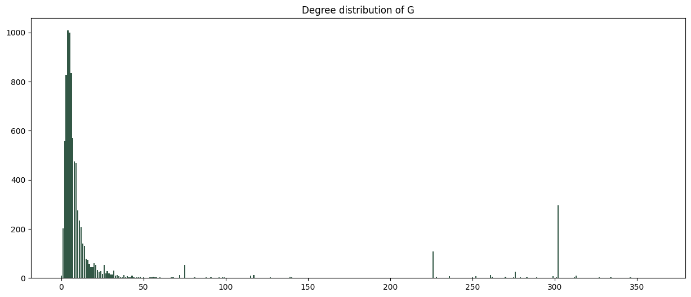
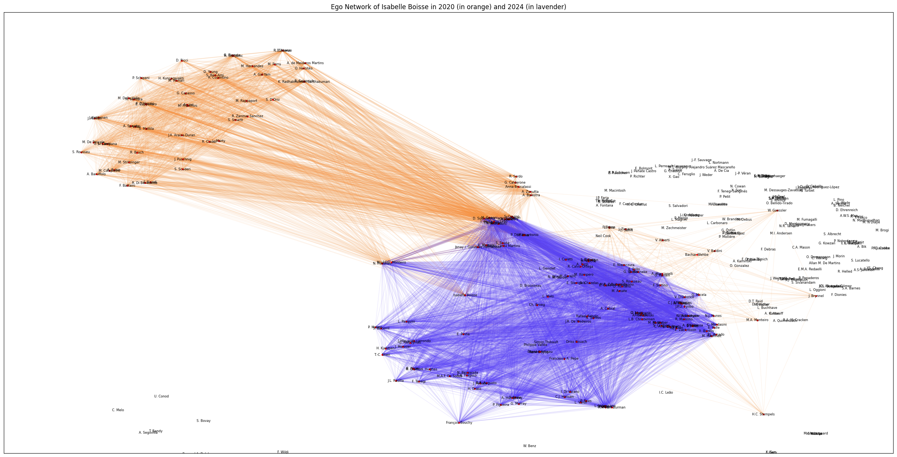

## Dev Team

* [Hipólito Filipe Costa de Araújo](http://github.com/iflipe)

## Video

    
  

## Summary

This second assignment uses the concept of a co-authorship network as an opportunity to work with more aspects of graphs like sub-graphing, density and sparsity, degree and methods of visualization as well as things more data science related like data cleaning and manipulation.

The notebook in this folder builds and analyzes a co-authorship network using data from the Scopus database. The activities include data cleaning, creating a graph, ranking authors, subgraphing, and calculating various statistics such as density and degree distribution.

## About the Data

The raw data consists of information about 3,666 publications by researchers at UFRN in the sub-area of engineering. Each publication includes details about the authors, title, year of publication, number of citations, keywords, and funding.

Not all fields were used and so there is potential for further exploration.

## Topics Studied

* Sub-graphing: Creating subgraphs based on different criteria such as most cited, most prolific, and most connected authors.
* Density: Calculating the density of the overall graph and various subgraphs.
* Degree: Analyzing the degree distribution of the graph to understand the connectivity of authors.
* Data Visualization: Visualizing the network of a small sample of authors in each subgraph and other aspects of the graph.

## Some Visualizations and Numbers

Some of the interesting info surfaced/generated by the analysis of the co-authorship graph are condensed below

### Degree Distribution of the Graph

### Comparison between global graph and its subgraphs

| |Nodes| Edges| Density (%) | Avg. Degree |
|:---:|:---:|:---:|:---:|:---:|
|Graph|||||
| Global | 8426 | 112162 | 0.315998 | 26.622834 |
| Cited | 191 |764 | 4.210526 | 8.0 |
| Prolific | 392 |1488 | 1.941646 | 7.591837 |
| Connected | 381 |33993 | 46.958143 | 178.440945 |
| 2020 | 1151 |10984 | 1.659653 | 19.086012 |
| 2024 | 1182 |51774 | 7.417787 | 87.604061 |

### Ego graph colored by year

## Conclusion

In the notebook the analysis of the co-authorship network reveals interesting insights into the academic collaborations at UFRN. The overall density of the graph is low, but specific subgraphs show higher density. The degree distribution highlights the presence of highly connected authors, which can be attributed to publications with a large number of co-authors. The visualizations provide a clear understanding of these patterns and help in drawing meaningful conclusions from the data.