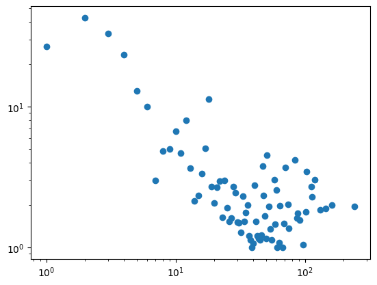

# U1T3 - Medicines and Assortativity

## Author
* [Hipólito Filipe Costa de Araújo](http://github.com/iflipe)

## Summary

This assignment explores the concept of graph assortativity using a dataset from the Brazilian Health Regulatory Agency (ANVISA) regarding the registration of medicines in Brazil. The goal is to test hypotheses related to the likelihood of medicines sharing certain properties and to analyze the assortativity of the resulting graphs.

The notebook builds and analyzes graphs based on the dataset, focusing on the relationships between medicines, their regulatory categories, therapeutic classes, and active ingredients. The activities include data cleaning, creating graphs, and calculating assortativity coefficients.

## About the Data

The raw data consists of information about the registration of medicines in Brazil, including details about the company, regulatory category, therapeutic class, and active ingredients for each medicine. The dataset is filtered to include only active/valid registries.

## Topics Studied

* Data Cleaning: Removing invalid entries and splitting relevant columns for analysis.
* Graph Construction: Building graphs to represent relationships between medicines based on shared properties.
* Assortativity: Calculating assortativity coefficients to understand the likelihood of medicines sharing certain properties.
* Data Visualization: Visualizing the graphs to provide insights into the relationships between medicines.

## Some Visualizations and Numbers

Some of the interesting info surfaced/generated by the analysis of the medicine registration graph are condensed below

### Assortativity Coefficient for Hypothesis #1

The assortativity coefficient for the graph based on the regulatory category is calculated to understand the likelihood of medicines in the same category sharing active ingredients.

```python
assortativity_by_reg_cat = nx.attribute_assortativity_coefficient(H1, 'reg_category')
print(assortativity_by_reg_cat)
```

### Graph Visualization



## Conclusion

The analysis of the medicine registration graph reveals interesting insights into the relationships between medicines in Brazil. The assortativity coefficient indicates that medicines in the same regulatory category are more likely to share active ingredients than those in different categories.