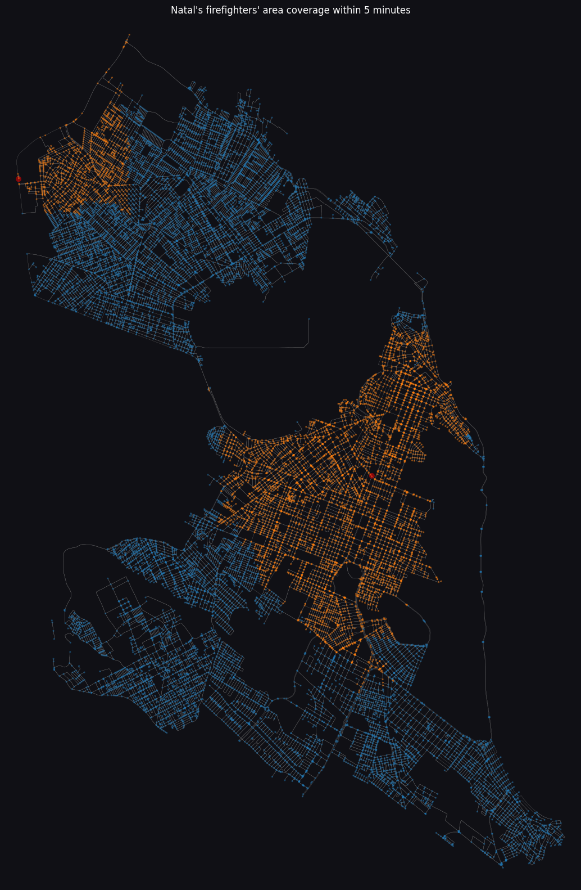
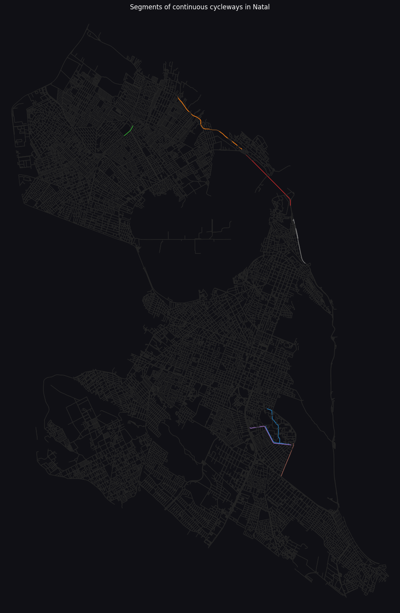

## Dev Team

* [Hipólito Filipe Costa de Araújo](http://github.com/iflipe)

## Summary

This assignment explores the street map of Natal - RN using the OSMnx library to gain insights into the response time of fire events and the connectivity of cycleways in the city. The notebook includes analyses on the area covered by fire stations within five minutes and the isolation of cyclists due to the disconnected network of cycleways.

## About the Data

The analyses are performed using the map of Natal. Fire station coordinates were acquired using Google Maps, and speed limits were determined based on the Brazilian Traffic Code.

## Topics Studied

* Fire Incident Response: Using the _shortest path algorithm_ in conjunction with the concept of _radius_ and _ego graph_ to visualize the area covered by fire stations within five minutes of a call.
* Cyclists' Isolation: Analyzing the connectivity of cycleways in the city via the study of _connected components_ as well as the existence of _cycles_, the average length of "maximum" bike courses and geographical location of the cycleways in order to discuss their usefulness.
* Data Manipulation and Visualization: Manipulate node and edge data to answer the proposed questions and show in a easy to read way the networks on study.

## Key Findings

### Fire Incident Response

The analysis shows that the fire stations can only cover a small portion of the city within five minutes. This suggests the need for additional fire stations to improve response times, since time is key in minimizing fire damage and loss of lives.

### Cyclists' Isolation

The network of cycleways in Natal is highly disconnected, forming isolated sections that are not work-commute friendly as they are not located within the areas where most people work. This limits the usability of cycleways for daily commuting.

## Visualizations

### Firefighters' Area Coverage

### Segments of Continuous Cycleways

## Conclusion

The analyses reveal that the current infrastructure for fire response and cycleways in Natal have room for improvement. The fire stations cover only a small portion of the city within five minutes, and the cycleways are disconnected. Further actions are needed to enhance the safety and mobility of the city's residents.