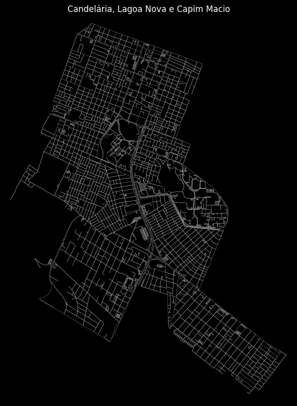
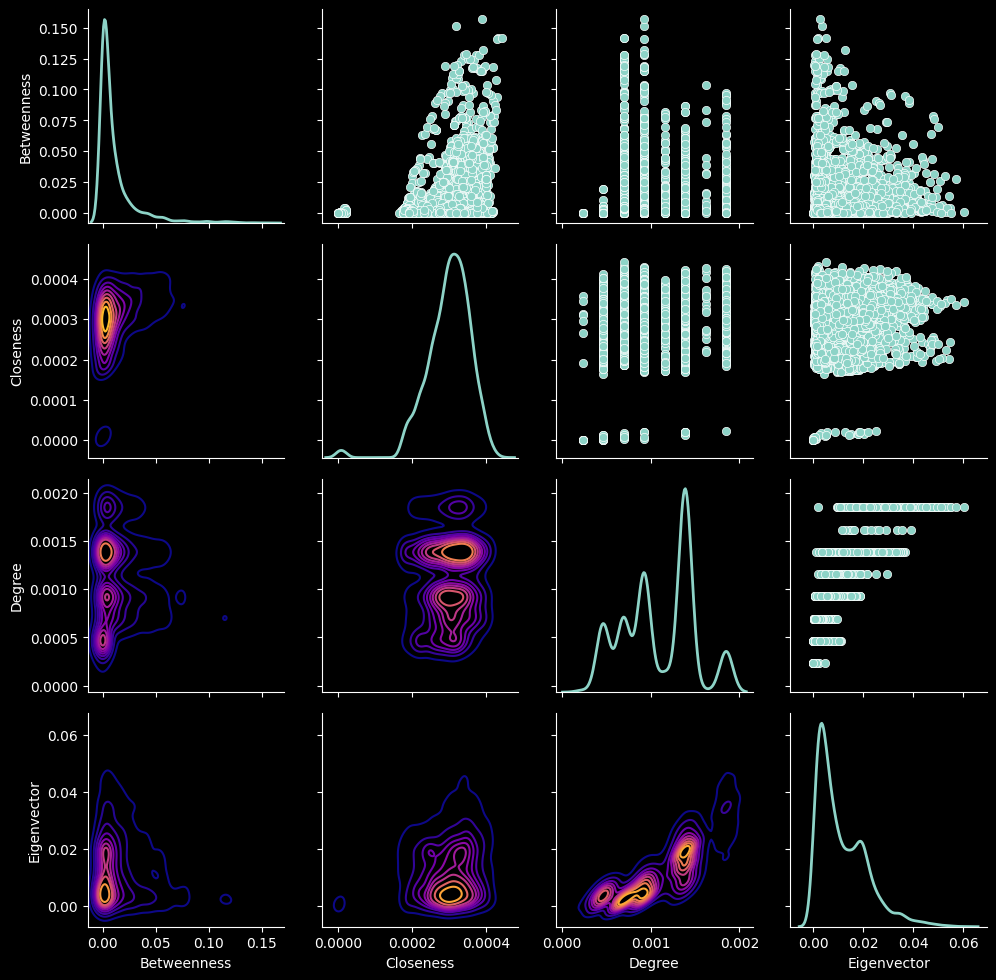
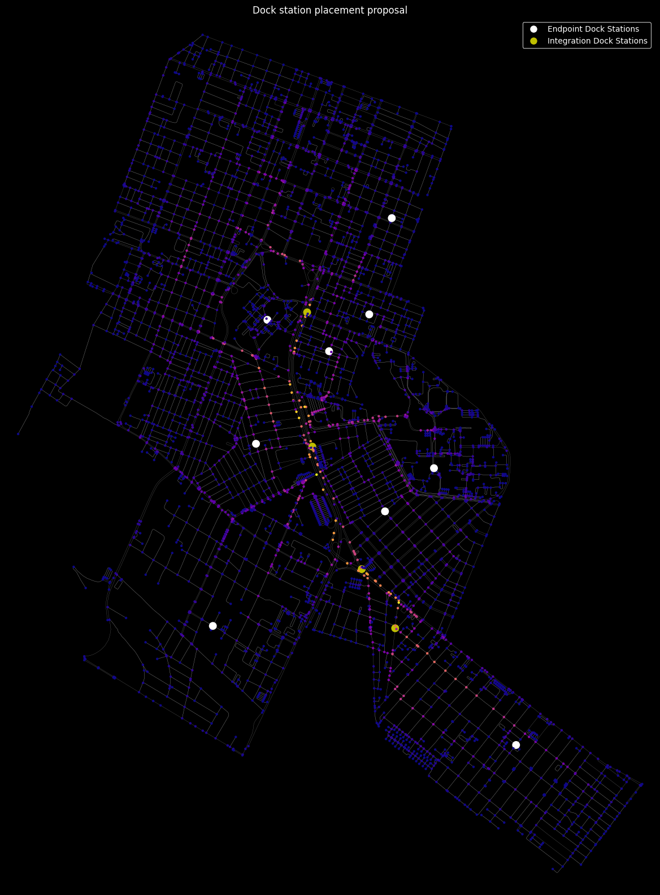

## Summary

This assignment concludes the first unit of the course exploring the placement of dock stations for bike sharing services in the neighborhood of UFRN's central campus using the OSMnx library. The notebook includes analyses on centrality measurements, degree distribution, and core analysis to determine the most suitable placement locations for dock stations.

    

## About the data

The analyses are performed using the map of Natal, specifically the neighborhoods of Lagoa Nova, Candelária, and Capim Macio. The map data is acquired using the OSMnx library.

## Topics Studied

* Centrality Measurements: Calculating and visualizing betweenness, closeness, degree, and eigenvector centrality to understand the importance of nodes in the network.
* Degree Distribution: Making a correspondence between the distribution of node degrees and the underlying grid system characteristic of the city urban planning.
* Core Analysis: Decomposing the network into its innermost core and shell to identify densely connected areas.

## Key Findings

### Centrality Measurements

* Eigenvector centrality and degree centrality are positively correlated for this network.
* Closeness and betweenness centrality highlight the structural axis centered in the map.
* Degree centrality doesn't seem to correlate with closeness or betweenness.

### Closeness Centrality

* Useful for identifying central locations within isolated neighborhoods for this particular problem.
* Not so useful if seem globally as this particular the analysis asks for a more decentralized approach.

### Degree Distribution

* Degree centrality is constrained by the city's grid system.
* Even degrees are more common than odd degrees.

### Core Analysis

* The innermost core matches to a certain extent to residential areas with dense street networks.
* The segmented core allows fortunately for a more even distribution of dock stations than the closeness analysis for a single neighborhood.

## Pros and Cons

**Pros**:
* Centrality measurements provide insights into the importance of nodes.
* Closeness centrality helps identify central locations within relevant subgraphs.
* Core analysis offers a method to distribute dock stations more evenly.

**Cons**:
* Degree centrality is less useful due to the grid system.
* Closeness centrality alone is insufficient for comprehensive analysis.

## Conclusion

Considering everything presented, we propose the following placement of a total of 13 dock stations for the bike sharing system:

The arrangement of these 9 endpoint stations not only can help improve the mobility of university students in and out the university campus but also helps people with their last mile daily commute as they are located in the heart of residential areas (with the exception of the one at the Administrative Center) and close to the structural mobility axis that have 4 integration stations to dock the bike and change mode of transportation for longer trips.

## Dev Team

* [Hipólito Filipe Costa de Araújo](http://github.com/iflipe)