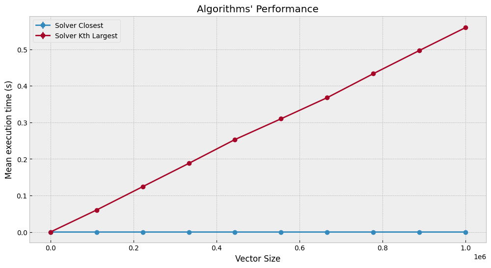
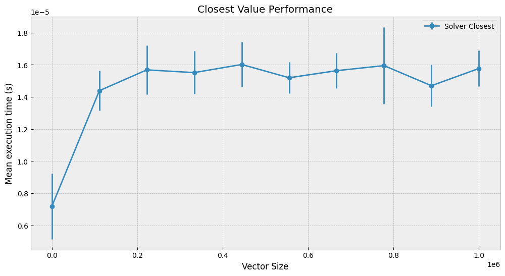

## Summary
This document summarizes the process and results of assessing the time complexity of two algorithms related to lookups in a Binary Search Tree (BST). The first algorithm returns the closest value present in the tree based on a target, while the second one retrieves the kth largest value in the tree.

## The Assignment
The task involves evaluating the performance of two algorithms concerning their time complexity:
1. `findClosestValue`: Finds the value in a BST that is closest to a given target.
2. `findKthLargestValue`: Retrieves the kth largest value in a BST.

## Methodology
The methodology applied in this assignment consists in running the algorithms repeatedly for various BST sizes to measure execution time using the `perf_counter` function from the `time` module. The tests are performed in reproducible randomly generated data for **10** trees with linear spaced sizes starting from **100** to **1000000**. A confidence level of **95%** was used to calculate a confidence interval to account for variations in execution time observed in the **20** times each algorithm ran in each configuration.

## Results
The results are presented in two plots:
1. **Overall Performance**: Shows the mean execution time for both algorithms. 
    
2. **Closest Value Performance**: Focuses on the performance of the `findClosestValue` algorithm.
    

## Discussion and conclusion
The results indicate that the `findKthLargestValue` algorithm exhibits a linear time complexity, as evidenced by the steady increase in execution time proportional to the size of the BST. In contrast, the `findClosestValue` algorithm demonstrates a logarithmic time complexity, with execution time increasing at a much slower rate relative to the tree size (see the Y scale in the second plot). The small error bars in the plots reflect the high reliability of the measurements, attributed to the large number of observations (20) for each test configuration.

## Dev Team

* [Hipólito Filipe Costa de Araújo](http://github.com/iflipe)

## Acknowledgment

Thanks to [@ivanovitchm](https://github.com/ivanovitchm) for providing the essentials to allow this analysis.