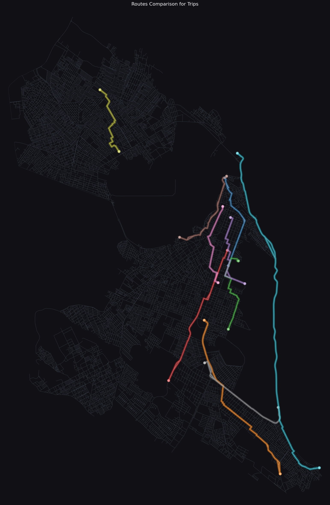
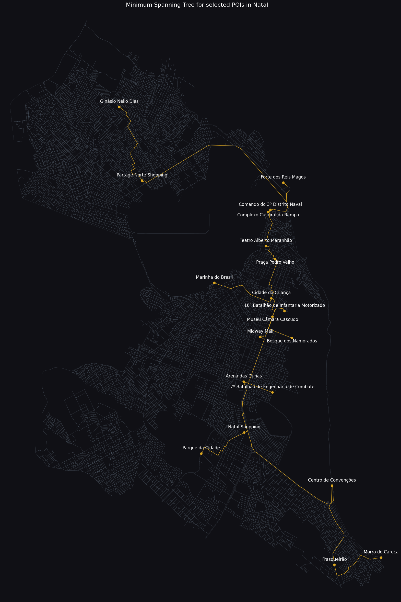

## Summary

This final assignment explores the differences in results obtained by the native Dijkstra implementation in networkX's shortest path algorithm and the version using Min Heap as an auxiliary data structure. It also find the Minimum Spanning Tree (MST) using Kruskal's Algorithm to connect all points of interest with minimal cost.

    <h4>Video Part I</h4>
    

    <h4>Video Part I</h4>
    
  

## Methodology

The work involves the drive network of Natal and 20 points of interest (POIs) arbitrarily defined within the city limits.

### Shortest Path Algorithm Comparison

We compare the native Dijkstra implementation in networkX with a custom version using Min Heap as an auxiliary data structure. The comparison involves calculating and storing the shortest paths for each pair of origin-destination trips and visualizing the routes.

### Minimum Spanning Tree

We create a Minimum Spanning Tree (MST) for the 20 POIs by first constructing a complete graph where each edge represents the shortest path between POIs. We then apply Kruskal's Algorithm to find the MST, ensuring minimal connection cost between all points of interest.

## Results

The results are presented in two plots:
1. **Shortest Path Algorithm Comparison**: Shows the results comparison between the native Dijkstra implementation and the Min Heap version. There are no differences in the results.
    

2. **Minimum Spanning Tree**: Illustrates the MST obtained using Kruskal's Algorithm spanning all 20 POIs.
    

## Analysis and Conclusion

As we can see, both implementations of Dijkstra's algorithm yielded the same routes, as expected. The real difference lies in the time complexity of the algorithms, which is not visually measurable. This complexity is difficult to assess in this assignment due to some issues.

Another important point is the information loss when converting a `MultiDiGraph` to a `MultiGraph`. This is evident when calculating the route lengths for each pair of nodes before generating the MST, as we may disregard potentially shorter edges by taking the length of the first one. Even if we considered the smallest edge, it might represent an edge in the wrong direction (e.g., a car driving the wrong way).

Regarding the trips and the MST, despite the MST having a short total length, it is not a fair comparison because the MST does not aim to minimize travel distance in all cases (e.g., frequent cul-de-sacs) and does not provide the thematic experience achievable with trips. However, the MST still has its uses.

## Acknowledgment

Thanks to [@ivanovitchm](https://github.com/ivanovitchm) for providing the essential material to make this analysis.

#### Dev Team

* [Hipólito Filipe Costa de Araújo](http://github.com/iflipe)